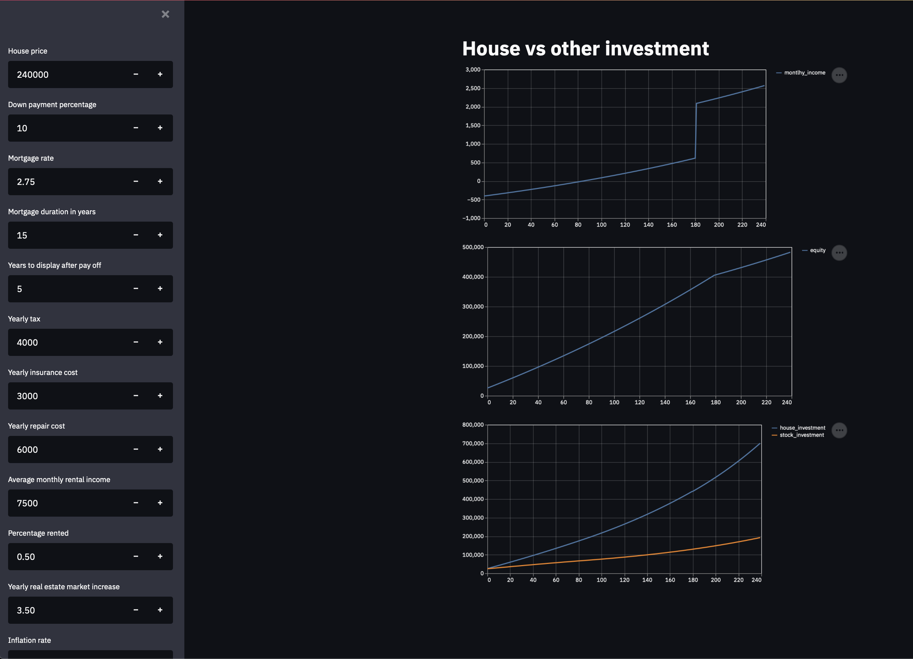

# Investate

### Overview
A collection of tools to find the value over time of various investments.
Initially motivated by investing in the real estate market, thus its name, the package has since grown to 
include tools to develop and backtest investment strategies for various investments.

### Intro
"How much would I have if I invest every month $10 on a bank account at a yearly rate of 5%"
Basic calculus offers a simple formula to answer the question above.
If more realistically, we invest a different amount every month, and the rate is changing over time,
there is no algebraic shortcut to get an answer. Instead you can use the function values_of_series_of_invest to get
an answer:

```python
from investate.series_utils import values_of_series_of_invest

values_of_series_of_invest(rate_between_period=[0.01, 0.005, 0.011], 
                           invest_values=[10, 12, 5])

27.292549999999995
```

### Backtesting
Investate contains simple yet flexible tools to backtest strategies. Below is an example based on the standard 
crossing averages buy/sell signal.

```python
import pandas as pd
import numpy as np
import matplotlib.pyplot as plt

# We choose a series of value of an investment over time, eth_series, the value of Ethereum
# over time
import pandas as pd
eth_series = pd.read_csv('test_dfs/eth.csv')['Last']
plt.plot(eth_series)
```


[comment]: <> (![alt text]&#40;https://raw.githubusercontent.com/cavart28/investate/main/.README_images/img.png&#41;)


We set our moving average parameters, namely the size of windows (which we call chunks here) used for the rolling means

```python
chk_size_1 = 10
chk_size_2 = 30
```

We can use get_comp_ma to get a dictionary containing the aligned numpy series of the moving averages
along with the original series, all appropriately cut off as to be time aligned.
```python
from investate.moving_average import get_comp_ma

stat_dict = get_comp_ma(eth_series, chk_size_1=chk_size_1, chk_size_2=chk_size_2)
stat_series_1, stat_series_2, cut_series = stat_dict['stat_series_1'], stat_dict['stat_series_2'], stat_dict[
    'cut_series']

fig, ax = plot_mas(**stat_dict)
```


We determine the daily growth of eth over the last 471 days (500 original minus the 30-1 days lost due to the 
largest of the two chunk size). 
```python
from investate.series_utils import values_to_percent_growth

period_rate_A = values_to_percent_growth(cut_series)
```

For the demo here, we will assume that the alternative investment is cash, and that cash does not yield any
interest. We represent its growth with the series of its daily returns, all zeros per assumption.

```python
# get the growth over time of the alternative investment, here we choose holding cash at 0% APR
period_rate_B = [0] * len(cut_series)
```

Our strategy is the classical "sma cross over", namely, we devest from ethereum anytime the fast moving 
average falls bellow the slow moving average. Conversely, we re-invest anytime the trend reverses.
The logic of the strategy is coded in the function invest_with_sma.

```python
from investate.backtesting_examples import invest_with_sma
invest_func = invest_with_sma(chk_size_1=chk_size_1, chk_size_2=chk_size_2)
```

Invest_with_sma applied to eth_series provides a series of 0/1 determining whether to invest in ethereum
for each period.  A 1 means "at the corresponding time,
invest all availalbe in A", while a 0 means "invest all available in B".

```python
invest_period = np.array(list(invest_func(eth_series)))
plt.plot(invest_period)
```


The user can provide any alternative function, as long as the function takes the original series as an input
and return a series of values a_i/b_i where a_i and b_i belong to the interval [0,1] and a_i + b_i = 1.
The meaning of a_i/b_i is that at period i, we will invest a_i * T_i in investment A and b_i * T_i on investment B,
where T_i is the total available at time i.


Finally, the function investment_over_period allows to track the value of each investment over time, using 
the series of 0/1 (invest/devest) generated by our strategy. Here we will assume we start with an
investment of 1 dollars in ethereum, 0 in cash and that the cost of buying/selling ethereum is 0.
(as specified by the fact that we set the fees_func_AB to None)


```python
val_A, val_B = investment_over_period(period_rates_A=period_rate_A,
                                      period_rates_B=period_rate_B,
                                      fees_func_AB=None,
                                      period_end_balance=invest_period,
                                      initial_investment_A=1,
                                      initial_investment_B=0)

plt.plot(val_A)
plt.plot(val_B)
plt.show()
plt.plot(cut_series / cut_series[0])
plt.show()

```


We can easily determine the final and total value of our investements

```python
total = np.array(val_A) + np.array(val_B)
print(total)
15.55
```
and we can compare it to holding 1$ in ethereum over the same period of time
```python
print(cut_series[-1] / cut_series[0])
15.94
```

The function provide a convenient way to compare and visualize the return of any sma crossover strategy
for any pair of fast/short moving average. We just need to specify the maximum size of each window, we chose 30 below.

```python
mean_return, mat = parameter_grid_search(eth_series, 30)
plot_mat(mat)
```


### Real estate investment
A streamlit app is provided to evaluate a real estate investment and it compare it to 
the same initial amount invested in a something like say the index 500. The app can be accessed by running
streamlit_house_app.py or alternatively use the url below:
https://investest.herokuapp.com

Note that the heroku version above may not be the latest. Below is a screenshot of the 
app. The parameters meaning should be clear from context.

